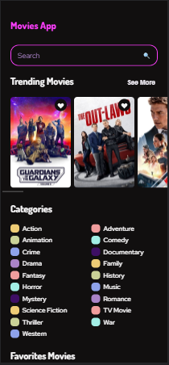

# Movies App

## Welcome! 👋

This is a project where I consume a movie API as practice for the Rest API Consumption with a JS course.

## Links!

  - Solution URL: https://mauricioc12.github.io/Project-API-Rest-JavaScript/
  
## My process

Know how to consume an API with JavaScript and adapt it to the project I want to do, designing with HTML and CSS.

## Built with: 

- Semantic HTML5 markup
- JavaScript
- API Rest
- CSS custom properties
- Responsive design
